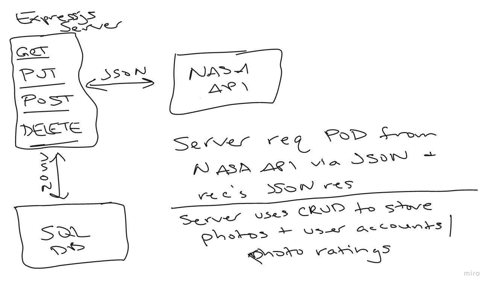
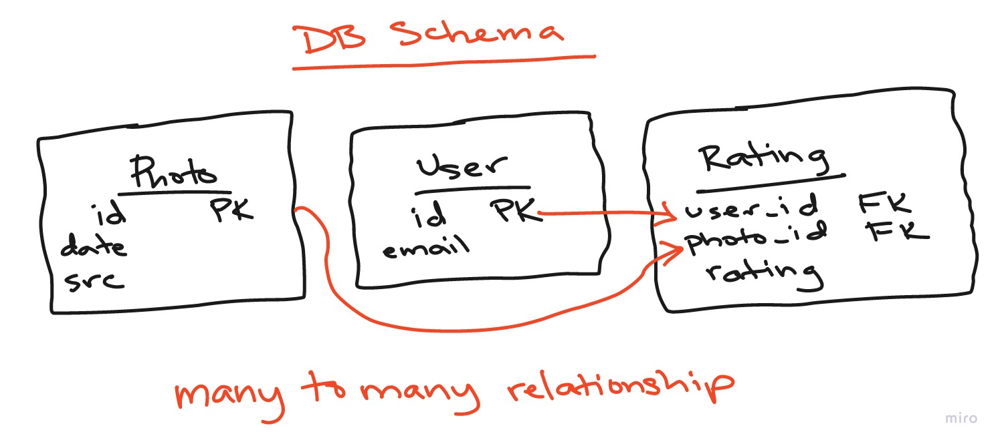

# NASA APOD Time-Capsule

[NASA APOD API](https://api.nasa.gov/index.html)

Get your API key at the link above

## RESTful Architecture + DB Schema




## Try Me

Deployed on **Heroku** [HERE](https://apod-time-capsule.herokuapp.com/)

`at this time there is not a front-end for this API`

### OR

After cloning the repo from Github run the following from the root of the project:

```bash
cp .env.sample .env
```

```es6
/* 
   update DEV_DATABASE_URI in newly created .env to reflect your local
   machine's PostgreSQL credentials to run a local db
   
   update APOD_API_KEY with your own key aquired from the link at the top of
   this readme.md
   
   run the following commands at the root of the project
*/
```

```bash
npm i && npm resetdb && npm start
```

### To reset the db at anytime

```es6
npm run resetdb
```

### Endpoints

GET /apod/ retrieves all photos stored in db

GET /apod/today retrieves photo of the day {TODO add middleware logic to tie in POST request for new photo}

POST /apod/check-today adds photo of the day to db

## Guidelines

- use API linked above
- **ALL** input + output data must be in JSON format
- use Express.js framework

## Functionality

- fetch **AND** save photo to the database
- create and delete users (e-mail field only)
- save a 1-5 star rating of a picture for a user
- allow user to update rating
- allow user to delete a rating
- get all of a user's ratings

## Checklist and Process

1. Choose database
    1. PostgreSQL database
    2. Completed
2. Create github repo with a README
    1. I will be making this repo public as requested (this is for consideration for employment)
    2. WIP "work in progress"
3. Make @bryanlanders a collaborator on repo
    1. Completed
4. Whiteboard a RESTful architecture (export JPG and include on README page)
    1. Completed
5. Code your endpoints
    1. Read and Create photo
        1. Completed
    2. Create users
    3. Delete users
    4. Create rating for user
    5. Update rating for user
    6. Delete rating for user
    7. Read all current user's ratings
6. Have your pair partner test your API locally
    1. Completed
7. Build unit tests for API if time allows
    1. Unfortunately I did not have time to nail down unit tests for this API, I will be going back and working those
       out as time permits